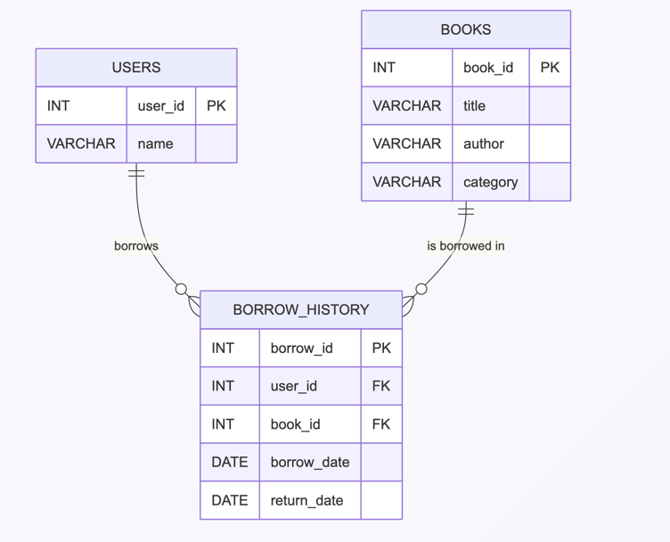

# 📚 Library Management System

This project is a simple library management system that tracks book borrowing history, user preferences, and provides recommendations based on borrowing patterns.

## ✨ Features
- 📖 Track borrowing history of users.
- 📊 Identify the most borrowed categories per user.
- 🏆 Display the top 5 most borrowed books.
- 🤖 Recommend books to users based on their favorite categories.

## 🗂 Project Structure
- `sql/analytics_queries.sql`: Contains SQL queries for analytics and reporting.
- `app/app.py`: 🐍 Python application for generating book recommendations.
- `app/database_setup.py`: Script to set up the SQLite database with schema and sample data.
- `sql/schema.sql`: Defines the database schema.
- `sql/sample_data.sql`: Contains sample data for populating the database.

## 🖼 ER Diagram
The following is the Entity-Relationship (ER) diagram for the database schema:



## 🛠 Requirements
- 🐍 Python 3.x
- 🗄 SQLite3

Install dependencies:
```bash
pip install -r app/requirements.txt
